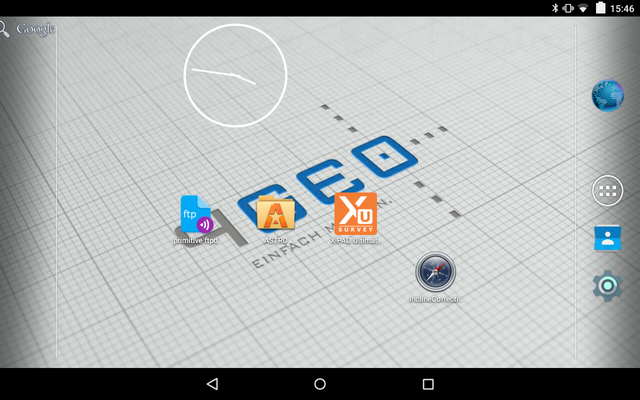
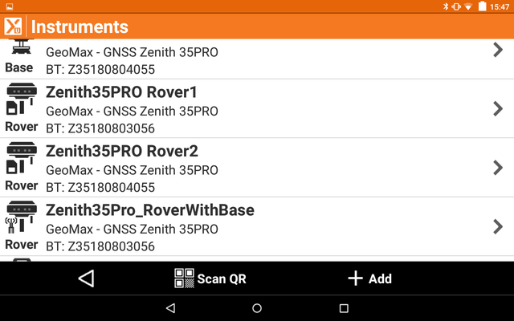
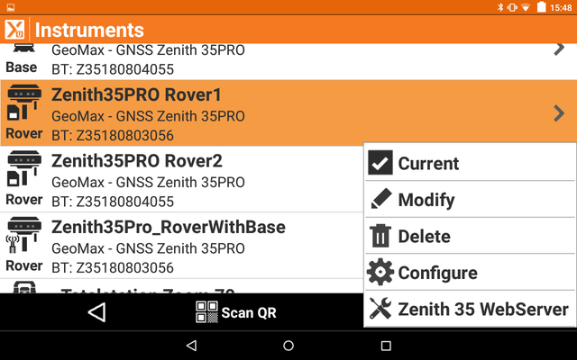
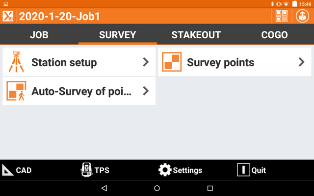
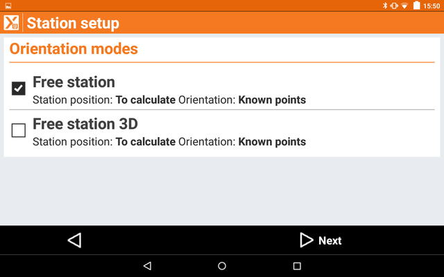
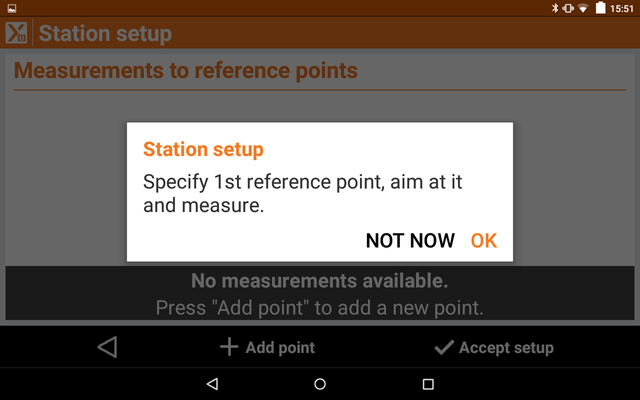
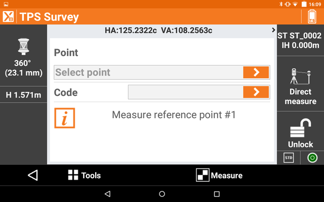
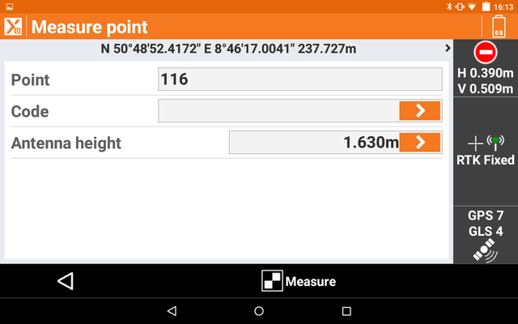
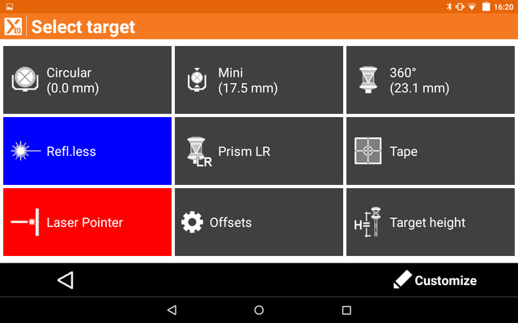
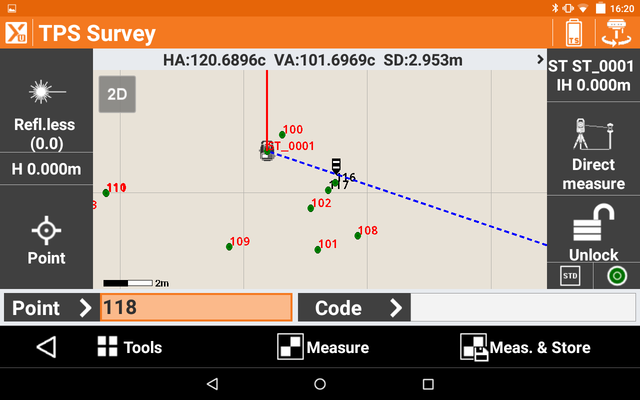

---
title:  "Totalstation setup with DGPS Rover"
layout: page
permalink: /Totalstation-Rover/
--- 

# Totalstation Setup with DGPS Rover

## Connecting the equipment

Total station (TS or TPS) can be used with a single rover or rover-base DGPS combinations. The following describes the steps required for measuring terrain and trees in the Marburg Open Forest.

* Start the X-Pad application

* Select the required job or create a new one

* To connect the equipment press Settings

* In Settings, select GNSS and Total station

* Depending on the context, tap either Zenith35PRO Rover1 or Zenith35PRO_RoverWithBase

* Press configure and wait until the end of the process

* Tap Totalstation Zoom 70 and choose current

## Station Coordinates and Orientation definition

* Go to Survey tab and tap Station setup

* Press New setup

* Select No. Station position has to be calculated

* Choose Free station

* For Free station, Instr. Height makes no sence (only if the ground point elevation will be used), thus, go Next

* Specify reference points (minimum two points are required, three recommended)

* Select the bottom-left green circle and adjust the level if necessary (do not change the level at any further step!)

* Press the Unlock button and tap Lock, the TS should be pointed to the prisma with DGPS. Go back

* In the point field select measure and press the Measure button, select the required GPS device

* Set the Antenna height (correct by default)

* Make sure that the horizontal and vertical errors are appropriate, press Measure. Change position of the prism and repeate the procedure

## Shooting/Measuring

* In Survey tab, press survey points, by default measures are conducted with the prism

* Tap the top-left prism icon and chose the reflectorless mode for massive shooting, tap the laser pointer to speed up the measurement

* Use Measure and Store for massive shooting, modify the point name (use conventional prefixes and predefined codes) 

